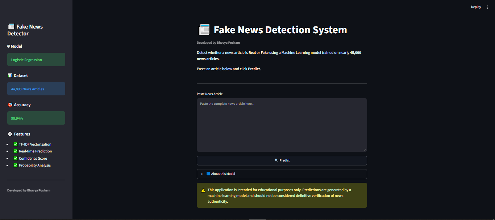
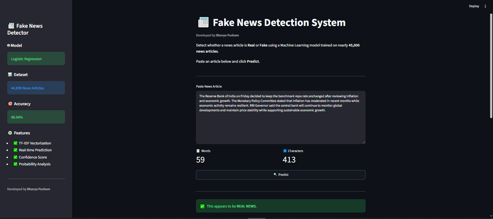
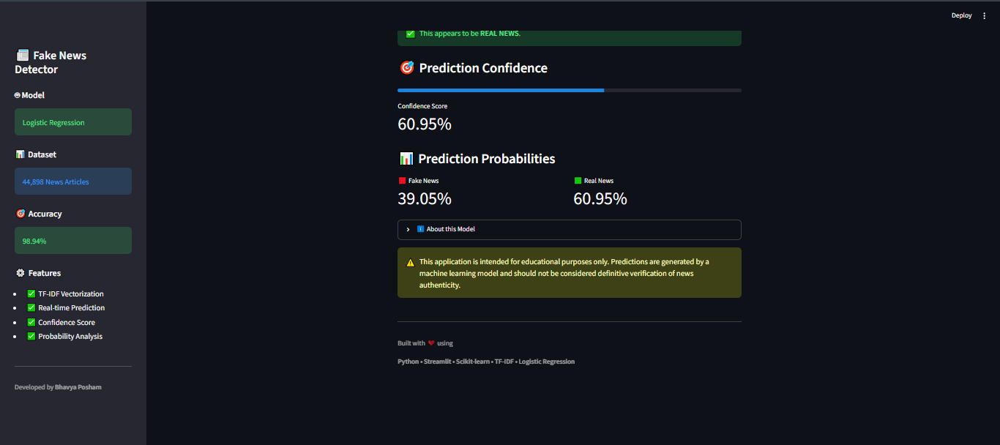
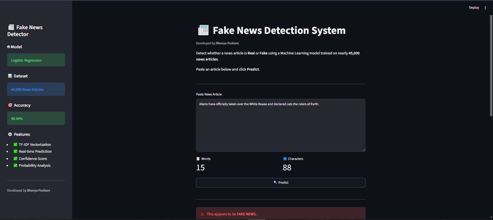
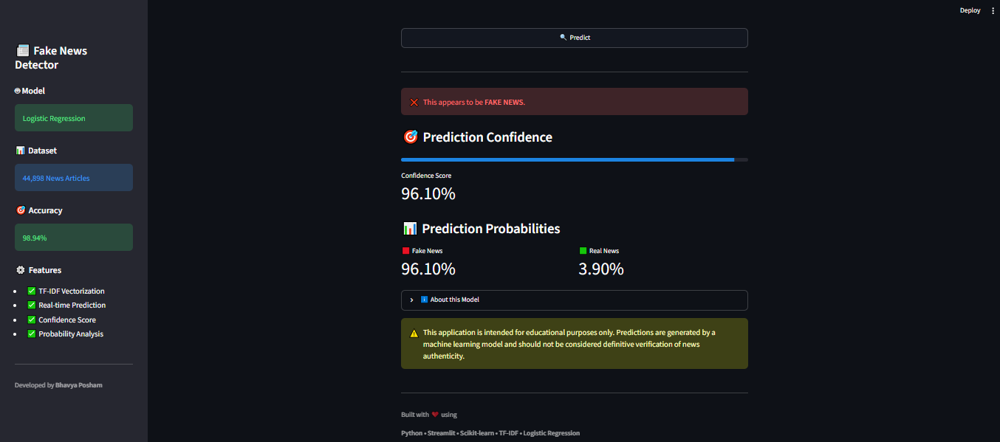
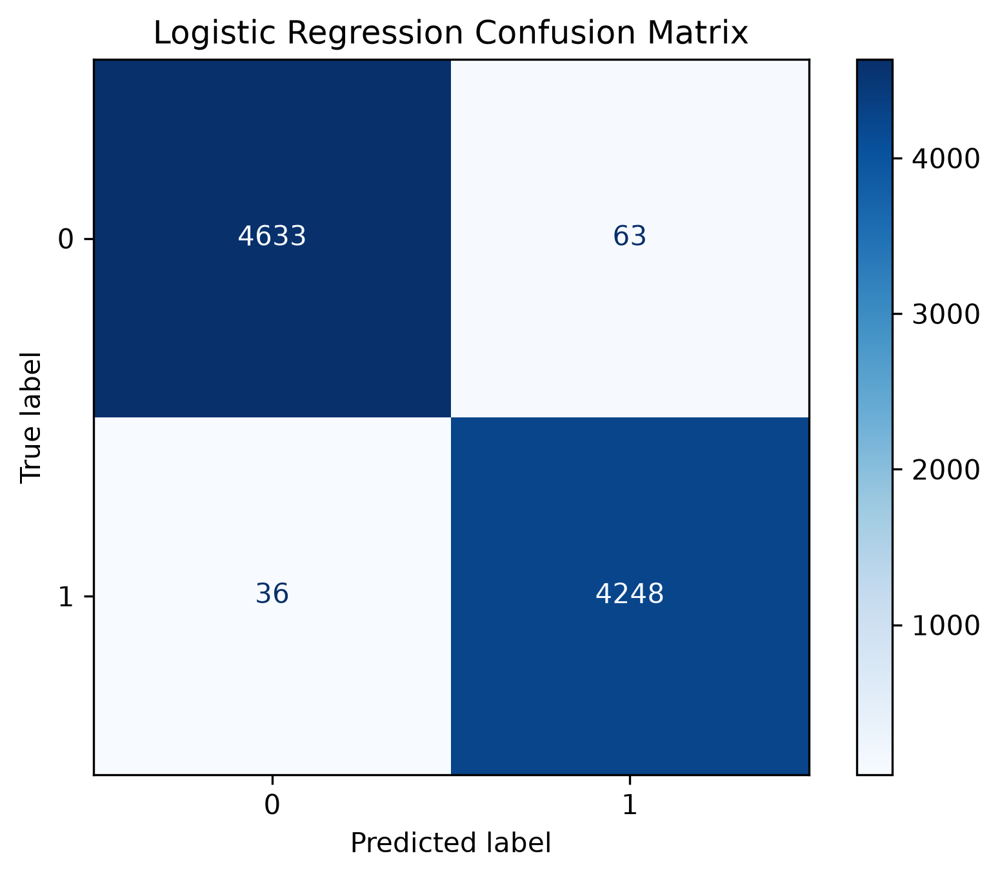
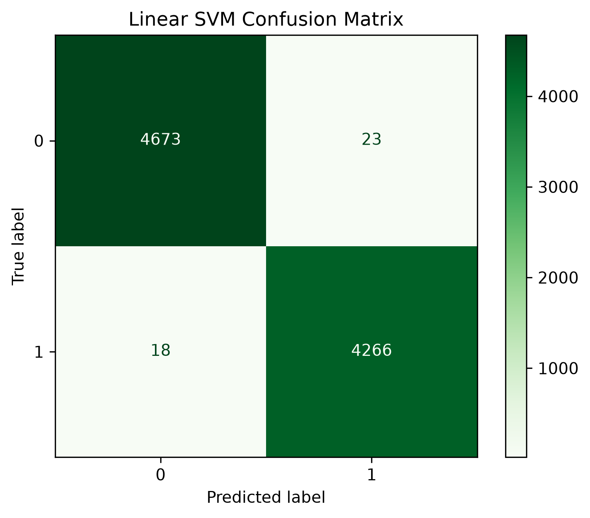
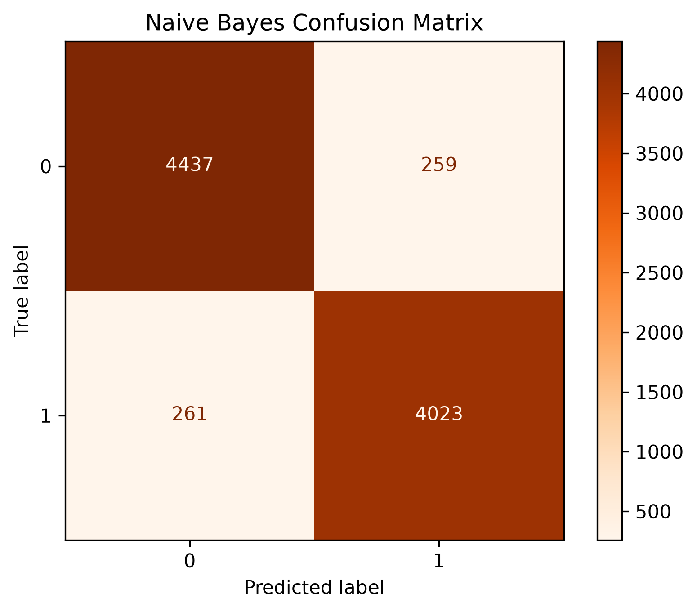
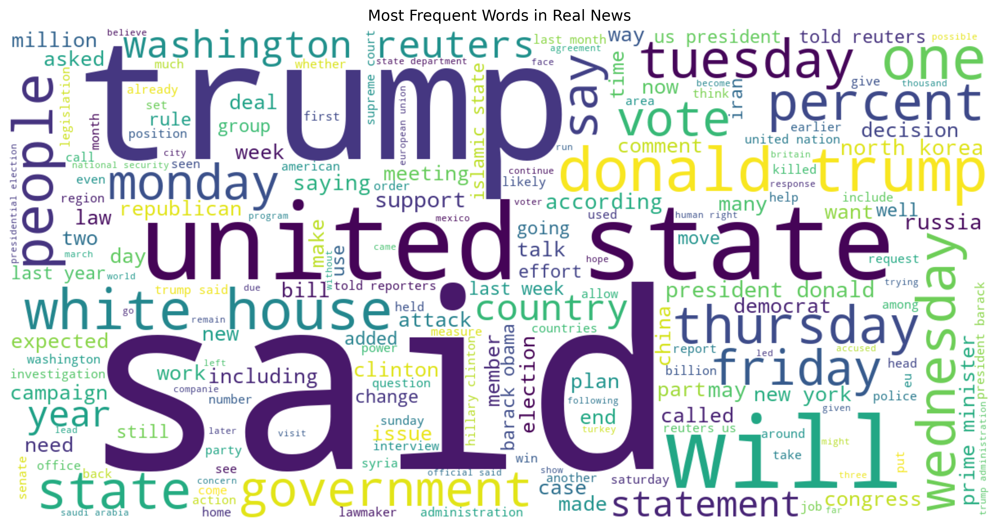
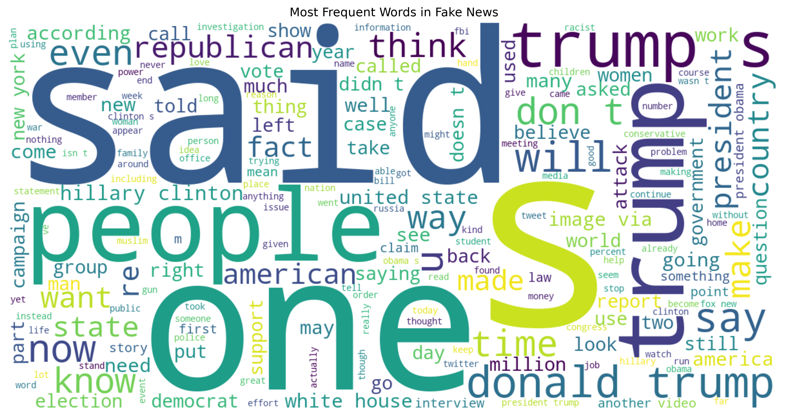

# 📰 Fake News Detection System

An end-to-end machine learning web application that classifies news articles 
as **Real** or **Fake** using NLP techniques, trained on nearly **45,000 news articles**.



## 🎯 Results

| Model | Accuracy |
|---|---|
| **Logistic Regression** | **98.94%** ✅ Selected |
| Linear SVM | ~98.5% |
| Multinomial Naive Bayes | ~94.2% |

## ✨ Features

- Real-time news classification with confidence scores
- Interactive Streamlit web interface
- Class probability display (Real vs Fake %)
- Complete NLP pipeline: preprocessing → TF-IDF → inference
- Confusion matrix and wordcloud visualizations

## 🛠️ Tech Stack

| Category | Tools |
|---|---|
| Language | Python |
| ML & NLP | Scikit-learn, TF-IDF Vectorization |
| Data Processing | Pandas, NumPy |
| Deployment | Streamlit, Joblib |
| Environment | Jupyter Notebook |

## 🗂️ Project Structure
fake-news-detection-ml/
├── app/
│   └── app.py                  # Streamlit web application
├── assets/                     # UI screenshots
├── data/
│   ├── Fake.csv                # Fake news dataset
│   ├── True.csv                # Real news dataset
│   └── src/                    # Sample data & training script
├── models/
│   ├── logistic_regression.pkl # Trained model
│   └── tfidf_vectorizer.pkl    # Fitted vectorizer
├── notebooks/
│   ├── 01_data_exploration.ipynb
│   └── fake_news_analysis.ipynb
├── results/                    # Confusion matrices & visualizations
├── src/
│   ├── preprocessing.py        # Text preprocessing pipeline
│   ├── train.py                # Model training script
│   └── predict.py              # Inference logic
├── requirements.txt
└── README.md
## 🚀 How to Run

**1. Clone the repository**
```bash
git clone https://github.com/ByteBandit0608/fake-news-detection-ml.git
cd fake-news-detection-ml
```

**2. Install dependencies**
```bash
pip install -r requirements.txt
```

**3. Run the Streamlit app**
```bash
streamlit run app/app.py
```

## 📸 Screenshots

### 🏠 Home Page


### ✅ Real News Prediction



### ❌ Fake News Prediction



## 📊 Visualizations

### Confusion Matrices
| Logistic Regression | Linear SVM | Naive Bayes |
|---|---|---|
|  |  |  |

### Word Clouds
| Real News | Fake News |
|---|---|
|  |  |

## 📋 Requirements
pandas
numpy
scikit-learn
streamlit
joblib
## 📌 Dataset

- **Source:** ISOT Fake News Dataset
- **Size:** 44,898 news articles
- **Labels:** REAL / FAKE

## 👨‍💻 Developed by

**Bhavya Posham**  
[GitHub](https://github.com/ByteBandit0608) • [LinkedIn](https://www.linkedin.com/in/bhavya-posham-208a702b0/)
